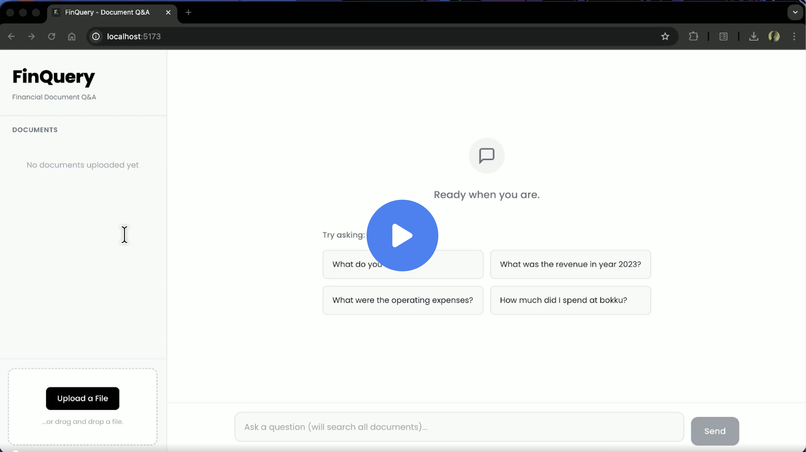

# FinQuery - AI Financial Assistant 
**FinQuery** is a high-performance, RAG-based system designed to help users extract *grounded*, precise insights from financial documents. By utilizing **hybrid search** (semantic `vector` search + keyword-based `BM25`), it ensures that numerical data and specific financial terminology are captured with high accuracy.


[](https://cap.so/s/c7mfqk9ebt8047n)
<p align="center">
  <b>FinQuery Demo</b> 
</p>

# Table of Contents
1. [Project Overview](#project-overview)
2. [Key Features](#key-features)
3. [Tech Stack](#tech-stack)
4. [System Architecture](#system-architecture)
5. [Project Structure](#project-structure)
6. [Getting Started](#getting-started)
7. [API Reference](#api-reference)
8. [Privacy & Security](#privacy--security)
9. [Coming Soon](#coming-soon)

---

## Project Overview
FinQuery addresses the **security** concerns of analyzing _personal_, dense `financial PDFs` by providing a localized interface where users can upload multiple documents and receive precise answers with exact page-level citations by utilizing a _hybrid retrieval_ pipeline and _rank fusion_ to minimize hallucinations in financial reporting.

## Key Features
* **Hybrid Retrieval Pipeline**: Integrates Dense Vector Search (semantic) with Sparse BM25 Search (keyword).
* **Reciprocal Rank Fusion (RRF)**: Merges disparate search results into a single, optimized context window for the LLM.
* **Multi-Document Intelligence**: Each document is managed in an isolated local collection, allowing for targeted or cross-document queries.
* **Page-Level Citations**: Every answer includes the source filename and specific page number (e.g., `report.pdf, page 5`).
* **Table-Aware Ingestion**: PDF processing is optimized to preserve the integrity of numerical data and tables.
* **Context Enhancement**: Tables are passed in a small llm call to to normalize them and add context that can improve semantic search 

---

## Tech Stack
### Backend
* **Core**: Python 3.13+.
* **Framework**: FastAPI.
* **LLM Engine**: Together AI (Meta-Llama 3.1 8B Instruct).
* **Vector Database**: ChromaDB (Persistent local storage).
* **Embeddings**: Sentence-Transformers (`all-MiniLM-L6-v2`).
* **Document Processing**: PyMuPDF and LangChain.
* **Table Extraction**: Camelot-py

### Frontend
* **Library**: React 19.
* **Build Tool**: Vite.
* **API Client**: Axios.

---

## System Architecture


---

## Project Structure
```text
finquery/
├── backend/
│   ├── chroma_db/               # local db (at runtime)
│   ├── src/
│   │   ├── models/
│   │   │   ├── schemas.py      # Pydantic schemas for API
│   │   ├── services/
│   │   │   ├── ingest.py       # PDF processing  
│   │   │   ├── process_tables.py   # table processing
│   │   │   ├── rag_engine.py   # Complete RAG logic
│   │   │   ├── retrieval.py    # BM25 and RRF algorithms
│   │   │   └── vector_store.py # ChromaDB management
│   │   └── main.py             # FastAPI app entry
│   ├── .env                    # Togetherai API
│   ├── pyproject.toml       
│   └── uv.lock                 # Dependencies
├── frontend/
    ├── src/
    │   ├── components/         # UI components 
    │   ├── api.js              # Axios service config
    │   ├── App.css             # Styling
    │   ├── App.jsx             # Root component
    │   └── index.css           # Styling
    └── package.json         # Frontend dependencies
```
---
## Getting Started

### Prerequisites
* Python 3.13 or higher.
* uv (Fast Python package manager)
* Node.js & npm.
* Together AI API Key.

### System Dependencies (Required for Camelot PDF Parsing)
Camelot requires **Ghostscript** and **Tkinter** to be installed on your system to process PDF tables:

* **macOS**:
```bash
brew install ghostscript tcl-tk
```

* **Linux (Ubuntu/Debian)**:
```bash
sudo apt update && sudo apt install ghostscript python3-tk
```

* **Windows**:
1. Download and install the Ghostscript AGPL Release.
2. Ensure the Ghostscript bin and lib folders are added to your System PATH.
3. Tkinter is typically included with standard Python installations on Windows.  

---
### Installation
1. Clone the Repository:
```bash
git clone https://github.com/datalordstephen/finquery.git
cd finquery
```

2. Backend Setup:
```bash
cd backend

# install dependencies
uv sync

# Activate the virtual environment
source .venv/bin/activate      # macOS/Linux
# .venv\Scripts\activate       # Windows (CMD)
# .venv\Scripts\Activate.ps1    # Windows (PowerShell)

# start the backend
uvicorn src.main:app --reload 
```

3. Create a `.env` file in this directory (backend):  
```bash
touch .env
```
4. Paste your together API Key
```env
TOGETHER_API_KEY=<your-key-here>
```
5. Frontend Setup:
```bash
cd ../frontend
npm install
npm run dev
```

The app should be running now and accessible at [http://localhost:5173/](http://localhost:5173/) 🎉

---

## API Reference
| Endpoint | Method | Description |
|-----------|---------|---------|
| `/upload` | `POST` | Processes a PDF and creates a new local document collection.
| `/query` | `POST` | Executes a hybrid RAG search across selected documents.
| `/documents` | `GET` | Lists all indexed documents and their metadata.
| `/documents/{doc_name}` | `GET` | Lists a particular  documents and it's metadata.
| `/documents` | `DELETE` | Deletes all collections 
| `/documents/{doc_name}` | `DELETE` | Removes a specific document and its associated data.

## Privacy & Security
* **Local Residency:** All financial documents are stored as text chunks and vector embeddings locally in your ./chroma_db directory.

* **Minimal Cloud Exposure:** Your full documents are never sent to the cloud. Only the small, specific text segments required to answer your query are shared with Together AI.

* **No Training:** Data sent via the Together AI API for generation is not used to train public models.


## Coming Soon
* **Evaluation**: Metrics for system's performance on test sets.
* **Cost Tracking**: Get reports on token usage and associated cost
* **Conversation Memory**: Store chat memory and refer to past messages.

---
<p align="center">
  Built with 💙 by <a href="https://github.com/datalordstephen"><b>datalordstephen</b></a>
</p>

